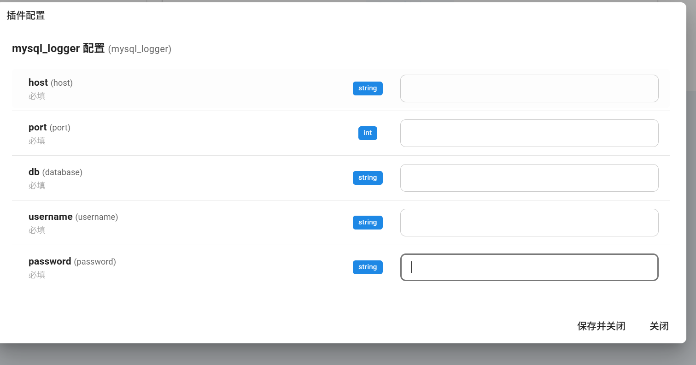

# MySQL存储
(支持 MySQL8 )
记录历史聊天信息, 会自动创建message表, 一切撤回都绳之以法！

功能：将所有聊天记录存入数据库。方便后续统计分析, 例如日活,月活,以及变相防撤回.

配置：


```sql
create table messages
(
    message_id    varchar(255) not null
        primary key,
    platform_type varchar(50)  not null,
    self_id       varchar(255) not null,
    session_id    varchar(255) not null,
    group_id      varchar(255) null,
    sender        json         not null,
    message_str   text         not null,
    raw_message   longtext null,
    timestamp     int          not null
) engine = InnoDB;

```
